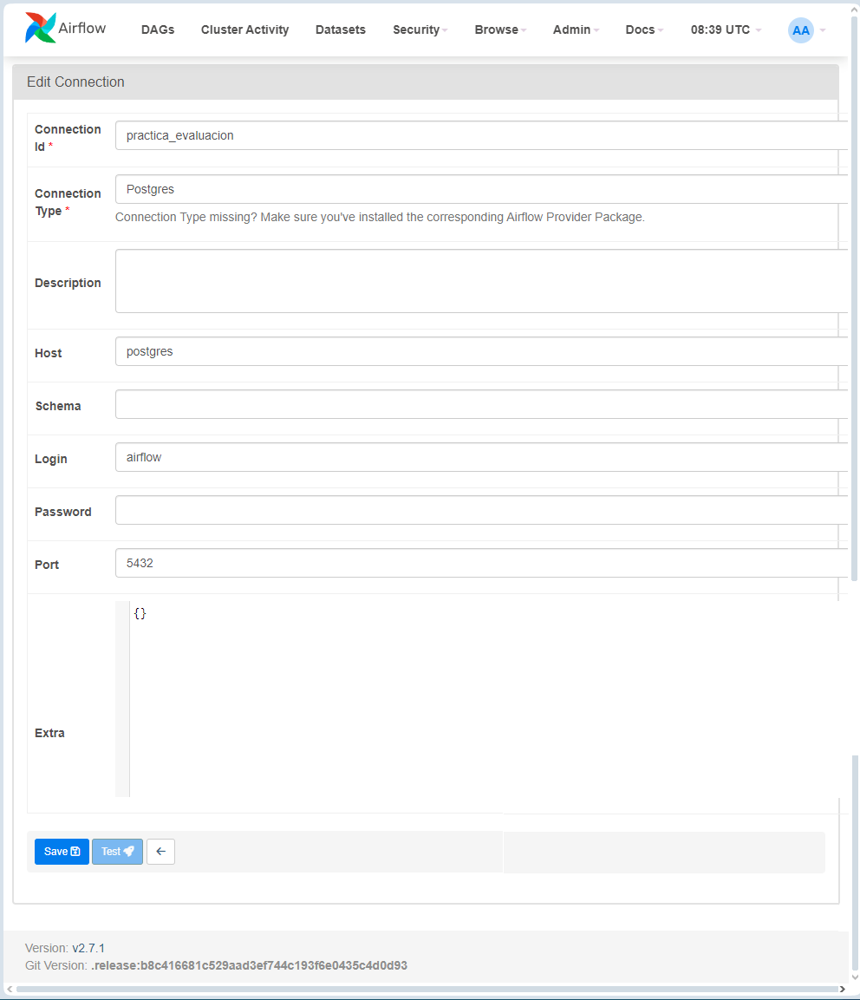

# Pasos a seguir

1. Para instalar Airflow, seguir los pasos que se indican en la ruta:
https://github.com/ulisesojeda/master_docs/blob/master/airflow_install/airflow_install_docker_compose.md 

2. Guardar el fichero 'dag_practica_evaluacion_AJ.py' en la carpeta 'dags' creada en el paso anterior.

3. Si no se ha hecho en el paso 1, abrir en el navegador http://localhost:8080/ con las credenciales: airflow/airflow.

4. En el menu superior, ir a "Admin" -> "Connections"

5. En la ventana pulsar el botón "+" para crear una nueva conexión.

6. En la siguiente ventana, incluir la siguiente información y finalmente pulsar el botón "Save".

   |   |  |
   |:---|:---|
   |Connection Id|practica_evaluacion|
   |Connection Type|Postgres|
   |Description||
   |Host|postgres|
   |Schema||
   |Login|airflow|
   |Password||
   |Port|5432|
   |Extra|{}|

   


7. En el menu superior, ir a "DAGs" y buscar la dag llamada "dag_practica_evaluacion.py".

8. Seleccionar la dag llamada "dag_practica_evaluacion.py".

9. Activar la dag o pulsar sobre el botón 'Play'.

10. Si todas las tareas se han ejecutado correctamente se mostrarán en verde.

11. Para comprobar que la información recuperada de la api está en base de datos:

   - Abrir consola en la ruta donde está desplegado el proyecto

   - Ejecutar: 
      ```
      docker exec -it docker_installation-postgres-1 bash
      ```
   
   - Ejecutar: 
      ```
      psql -U airflow
      ```
   
   - Ejecutar:
      ```
      select * from table_tweets;
      ```
   
   

   - Para salir de base de datos ejecutar:
      ```
      \q
      ```
   
   - Para salir del contenedor ejecutar:
      ```
      exit
      ```