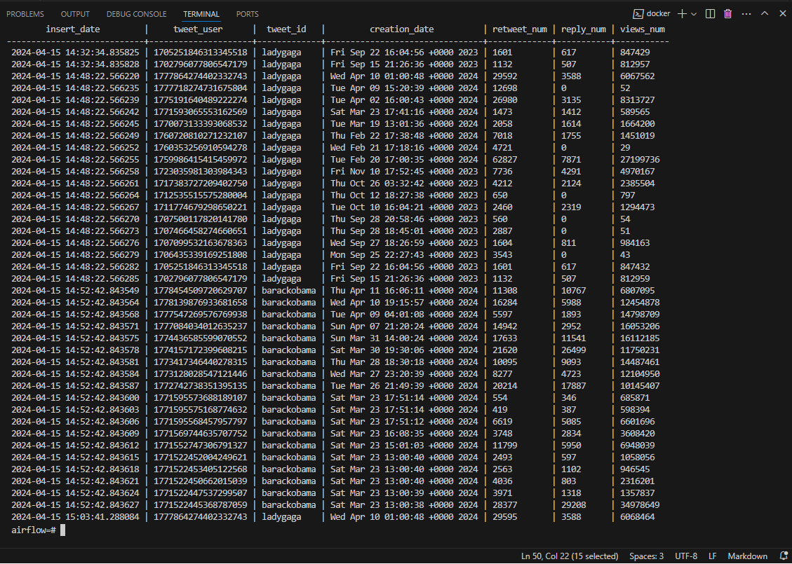

# Práctica en GitHub
   ```
   https://github.com/segweba/practica_airflow.git
   ```

# Instalación Airflow

- Seguir los pasos que se indican en la ruta:
https://github.com/ulisesojeda/master_docs/blob/master/airflow_install/airflow_install_docker_compose.md 


# Descripción de la práctica

- La DAG tiene como objetivo conectar con la API web https://rapidapi.com/omarmhaimdat/api/twitter154/, obtener los tweets publicados por un usuario en la red social Twitter y finalmente guardar la información recolectada en base de datos.


# Consideraciones previas - Requisitos

- Para un correcto funcionamiento de la DAG se requiere tanto el nombre como el id de usuario en la red social.

- El nombre es público y se puede obtener fácilmente. Para obtener el id de usuario, se recurre a la web https://twitter154.p.rapidapi.com/user/tweets, la cual proporciona el dato que se necesita.

- Para esta práctica se han seleccionado cuatro usuarios de Twitter y en cada ejecución se genera un número aleatorio para que los datos descargados pertenezcan a diversos usuarios. 


# Descripción de la DAG

- **check_web**: Realiza un _request_ a la web donde se aloja de API para comprobar si está disponible. Si lo está devuelve _True_, en caso contrario _False_. Pertenece al grupo "group_api".

- **extract_tweets**: Si la web está operativa, recupera los tweets publicados por un usuario (aleatorio entre los seleccionados en código). La salida será la lista de tweets y el nombre de usuario. Si la web está caida devuelve una valor _None_. Pertenece al grupo "group_api".

- **create_table**: Cree la tabla *table_tweets* en la base de datos Postgres, la cual almacenará la información obtenida de la API. Si ya existe la tabla, no hace nada.

- **process_tweets**: Prepara la información recopilada para insertarla en base de datos y la guarda en un fichero temporal. Este proceso sólo se ejecutará sí los procesos previos "group_api" y "create_table" se han ejecutado correctamente.

- **store_info**: Almacena los tweets en base de datos. 

- **print_info**: Muestra los tweets almacenados en base de datos en la consola de Airflow.


# Manual de uso

1. Guardar el fichero 'dag_practica_evaluacion_AJ.py' en la carpeta 'dags' creada durante el proceso de instalación.

2. Abrir en el navegador http://localhost:8080/ con las credenciales: airflow/airflow.

3. En el menu superior, ir a "Admin" -> "Connections"

4. En la ventana pulsar el botón "+" para crear una nueva conexión.

5. En la siguiente ventana, incluir la siguiente información y finalmente pulsar el botón "Save".

   |   |  |
   |:---|:---|
   |Connection Id|practica_evaluacion|
   |Connection Type|Postgres|
   |Description||
   |Host|postgres|
   |Schema||
   |Login|airflow|
   |Password||
   |Port|5432|
   |Extra|{}|

   


6. En el menu superior, ir a "DAGs" y buscar la dag llamada "dag_practica_evaluacion.py".

7. Seleccionar la dag llamada "dag_practica_evaluacion.py".

8. Activar la dag o pulsar sobre el botón 'Play'.

9. Si todas las tareas se han ejecutado correctamente se mostrarán en verde.

10. Para comprobar que la información recuperada de la api está en base de datos:

   - Abrir consola en la ruta donde está desplegado el proyecto

   - Ejecutar: 
      ```
      docker exec -it docker_installation-postgres-1 bash
      ```
   
   - Ejecutar: 
      ```
      psql -U airflow
      ```
   
   - Ejecutar:
      ```
      select * from table_tweets;
      ```
   
   

   - Para salir de base de datos ejecutar:
      ```
      \q
      ```

   - Para borrar los registros de la tabla o la tabla completa [Opcional]:
      ```
      delete from table_tweets;
      drop table table_tweets;
      ```

   - Para salir del contenedor ejecutar:
      ```
      exit
      ```